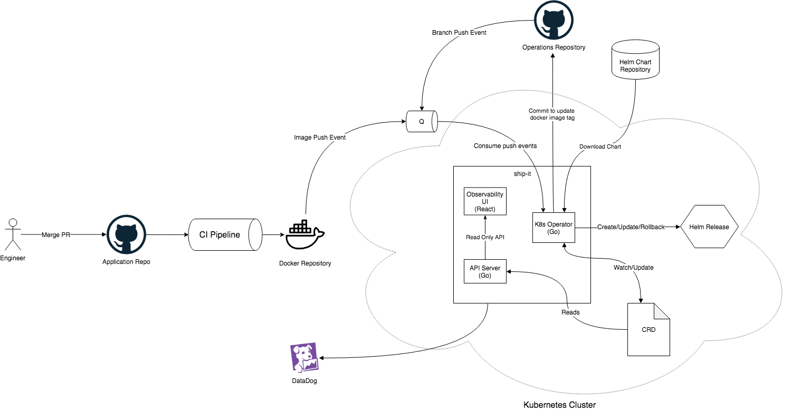

# Ship-it! Overview

This document provides a summary of Velocity's Kubernetes deployment tool Ship-it. Documentation pretaining to registering and deploying microservices with Ship-it is [here](./REGISTER.md).

Ship-it is designed to be a GitOps tool for Kubernetes, to learn more about GitOps click [here](https://www.weave.works/blog/what-is-gitops-really).

## Background

Before Ship-it, there was [Kube-deploy](https://github.com/Wattpad/kube-deploy). Kube-deploy serves the simple purpose of deploying docker images to Wattpad's Kubernetes cluster. As a result, Kube-deploy is not built in an extensible way. Instead of rewriting Kube-deploy, Velocity decided to build a new tool to serve as a more extensible foundation for CD, and called it _Ship-it!_. Ship-it would have the features required for developers to confidently push changes to production. while providing full visibility at each stage of the deployment process. Specifically, Ship-it would put in place the following features and practices:  

- Automated rollbacks based on release state and Data Dog monitors
- A web UI to watch deployments and their state (deploying, deployed, rolled back etc.)
- Standardized and extensible Helm charts for deployments instead of a k8s.yml file
- Use of Custom Resource Definitions and Kubernetes Operators. The operator will reconcile the state of miranda (Wattpad's operations and config repository) with the state of the cluster
- Event driven architecture for detecting developer actions.
- Unit testing and test driven development
- Cloud agnostic project where business logic is decoupled from the API calls it depends upon

## Diagram

## Deployment Process Overview

This section follows the architecture diagram above. Below is a list of each step Ship-it takes behind the scenes to take code changes and deploy them to Kubernetes. Specifically, it is an outline of the deployment process for a service that is already registered.

1. Microservices containing code changes get built into new Docker images by Travis CI. The built images are then pushed to a docker registry in ECR.

2. A CloudWatch Rule picks up the push event and drops some metadata about the event into an SQS queue.

3. Ship-it's SQS consumer takes the image push event and parses out the  image tag. The tag is then used to update the custom resource YAML file with the latest running version of the service.

4. To deploy the service, Ship-it downloads the Helm chart for the service. Using the chart, Ship-it executes the deployment with the Helm API.

5. The `HelmRelease` custom resource is updated using the Kubernetes operator within ship-it to change the state of the release.

6. The operator will update the `HelmRelease` each time the release state changes.

7. The API server reads off the `HelmRelease` to get the state of each Helm Release and exposes a REST API to read information about the releases.

8. The Web UI consumes this API to present engineers with key deployment information.

9. If all goes according to plan the state of the release should advance from "deploying" to "deployed". If there is an issue, a rollback is triggered and the "rolled back" state is reflected on the UI.
