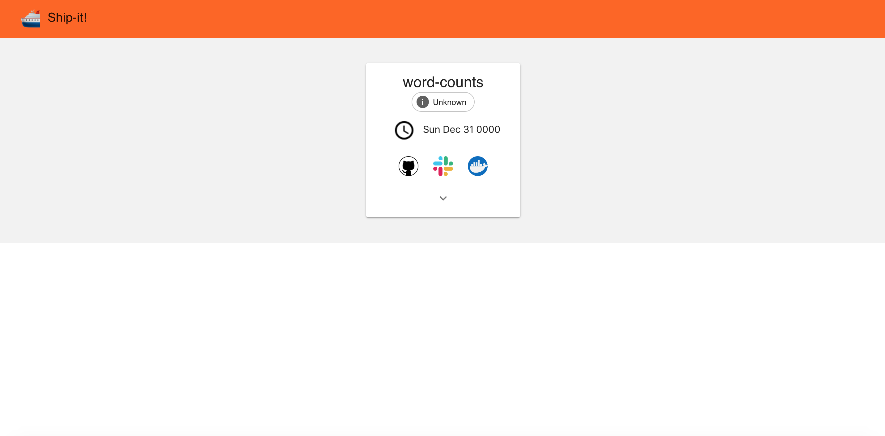

# Service Registration with Ship-it!

This document provides instructions on registering a service to be continuously deployed with Ship-it. It is assumed that the service we are deploying is ready to be built into a docker image and sent to a docker repository. At Wattpad, this means the service (or changes to an existing one) are in PR and ready to be merged into highlander.  

To register the service with Ship-it, it needs to be added to the `ship-it-registry` chart, which is found in the repository providing the source of truth for the state of Kubernetes. At Wattpad, this repository is miranda. To configure the service for deployment, an entry must be added to the `templates` folder of this chart. The name of the file should match the release's name. Below is an example for the word-counts service.  

`word-counts.yaml`
```
apiVersion: shipit.wattpad.com/v1beta1
kind: HelmRelease
metadata:
  name: word-counts
  annotations:
    helmreleases.shipit.wattpad.com/autodeploy: "true"
    helmreleases.shipit.wattpad.com/code: "https://github.com/Wattpad/highlander/tree/master/wattpad/src/services/word-counts"
    helmreleases.shipit.wattpad.com/datadog: "https://app.datadoghq.com/dashboard/xjd-bhb-3d9/word-counts-service"
    helmreleases.shipit.wattpad.com/slack: "#squad-velocity"
    helmreleases.shipit.wattpad.com/squad: "velocity"
    helmreleases.shipit.wattpad.com/sumologic: "https://service.us2.sumologic.com/ui/#/search/FS9RYU6LlHWYF082XFBGJ9oK698pJThnNQ1l18r0"
spec:
  releaseName: word-counts

  chart:
    repository: https://wattpad.s3.amazonaws.com/helm-charts
    name: sqs-consumer
    version: HEAD

  values:
    autoscaler:
      queueName: word_counts

    image:
      repository: 723255503624.dkr.ecr.us-east-1.amazonaws.com/word-counts
      tag: a64c7561475de682b4a4dff66f775282631643ed

    iamRoleName: word-counts

    env:
      - name: AUTHORIZATION_HEADER
        valueFrom:
          secretKeyRef:
            name: homeapikey
            key: apikey
      - name: QUEUE_NAME
        value: "word_counts"
      - name: AWS_REGION
        value: "us-east-1"
      - name: PROMETHEUS_HOST
        value: "http://track-service"

    resources:
      request:
        memory: "126Mi"
        cpu: "100m"
      limits:
        memory: "0.5Gi"
        cpu: "250m"
```

The file represents a Kubernetes custom resource object of kind `HelmRelease`. The important fields to note are `annotations` and `chart`. The annotions should be populated as shown above with links to the code, ownership squad, data dog dashboard, auto deploy flag and a sumologic query for the service logs. The chart field should name the location of the chart repository, a path to the specific chart and the desired revision. The `section` of the custom resource will vary depending on the chart to which you are supplying values and how it is templated. The example above provides values for an `sqs-consumer` chart used at Wattpad.  

Once the custom resource definition is completed, create a PR in the repository containing the registry chart which adds the file to the template folder. Merging the PR will make the custom resource available to Ship-it when it deploys your service.  

At this point, you can send your docker image of the service to the docker repository on which Ship-it is listening. At Wattpad, this is done by merging the PR with the service to master in highlander which automatically builds and pushes an image. As soon as the image is uploaded, Ship-it will consume the image push event and deploy the image to cluster using the specifications provided by the custom resource for the service.  

The deployment of the service can be observed using the Ship-it dashboard.  



To double check the status of the deployment, you can use the `helm` CLI tool.  

Running `helm status SERVICE_NAME` will list out all the pods associated with the release and their state. The output should be similar to the following:

```shell
$ helm status word-counts
LAST DEPLOYED: Thu Aug  1 09:59:52 2019
NAMESPACE: default
STATUS: DEPLOYED

RESOURCES:
==> v1/Pod(related)
NAME                                     READY  STATUS   RESTARTS  AGE
word-counts-autoscaler-5dc645b86c-w46j8  1/1    Running  0         22d
word-counts-b4f5f45b7-drbzp              1/1    Running  2         5d23h

==> v1beta1/Deployment
NAME                    DESIRED  CURRENT  UP-TO-DATE  AVAILABLE  AGE
word-counts-autoscaler  1        1        1           1          56d

==> v1/Deployment
NAME         DESIRED  CURRENT  UP-TO-DATE  AVAILABLE  AGE
word-counts  1        1        1           1          56d
```
